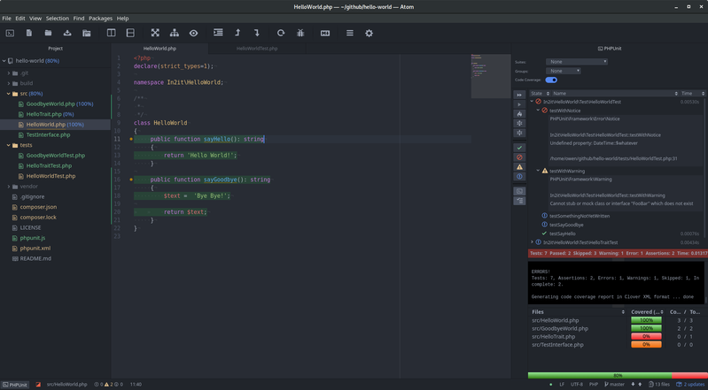

## php-unit-integrator package

Integrates the phpunit testing system into the atom text editor.

This is in beta mode at the moment. I would appreciate any testers and feedback.

###### Features:
1. Point and click interface
1. Code Coverage highlighting
1. Test Suite/Case generation (requires php-integrator)
1. `phpunit.xml` and `phpunit.xml.dist` aware
1. Run a full suite or re-run selected test cases
1. Quick navigation links to errors
1. Progressive test output
1. Vertical / Horizontal layout

###### Keyboard shortcuts

* `cmd-alt-t` | `ctrl-alt-t`: Runs the currently selected test suite
* `cmd-alt-f` | `ctrl-alt-f`: Runs the open file
* `cmd-alt-c` | `ctrl-alt-c`: Runs the test class under the cursor
* `cmd-alt-y` | `ctrl-alt-y`: Runs all test suites in the `phpunit.xml` file
* `cmd-alt-g` | `ctrl-alt-g`: Runs all files in the test directory
* `cmd-alt-v` | `ctrl-alt-v`: Runs the test method under the cursor

###### Background
After switching to atom, I missed the phpunit integration within the netbeans
editor. This is an attempt at creating a similar environment.

Copyright (c) 2018 Owen parry <waldermort@gmail.com>
